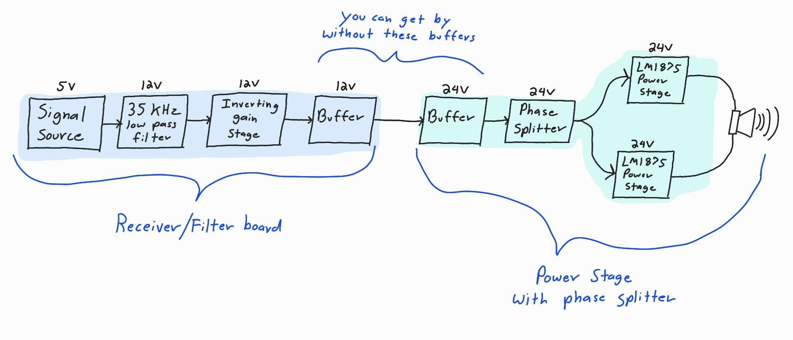
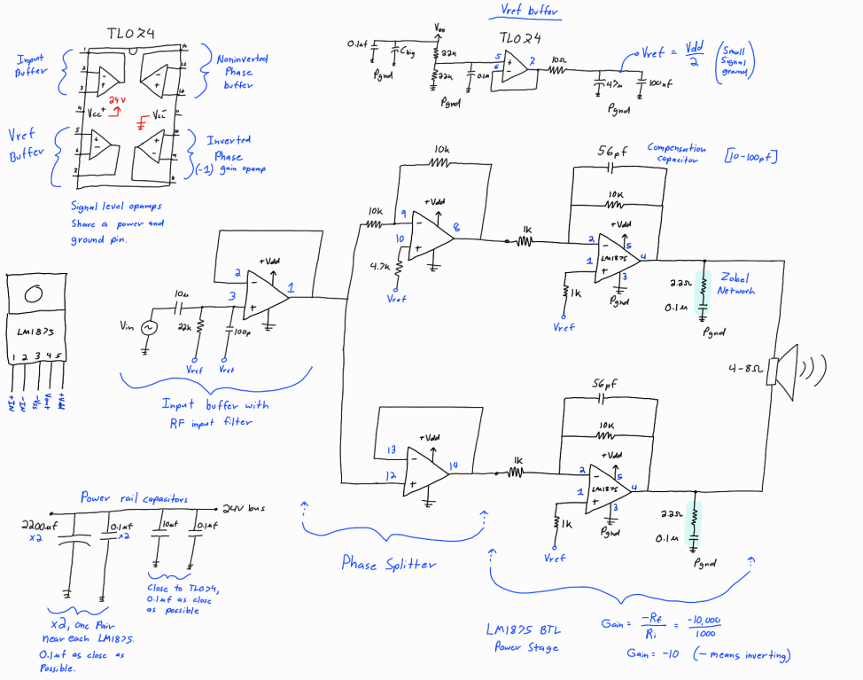
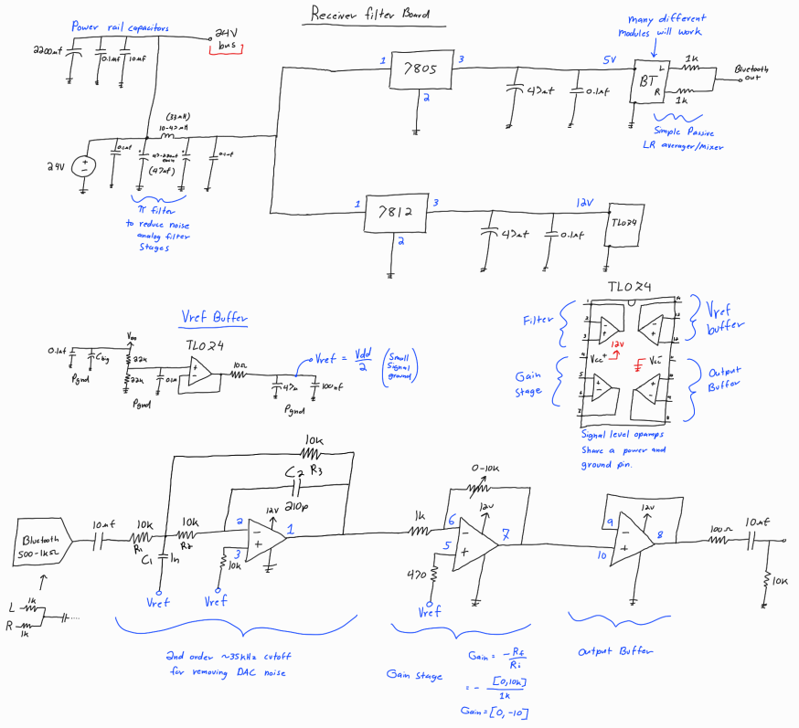
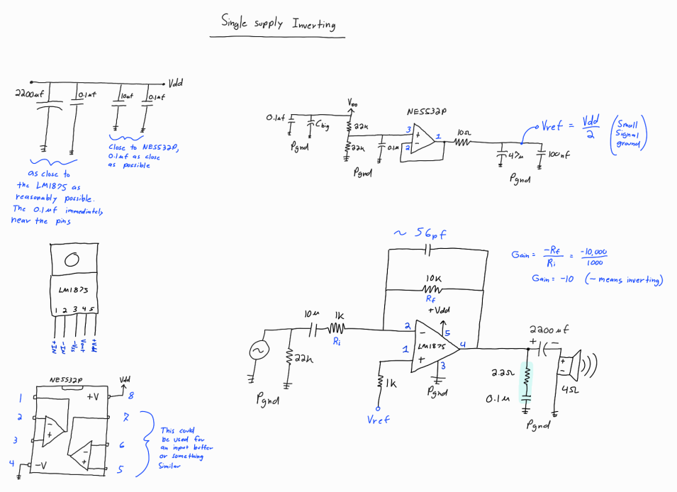
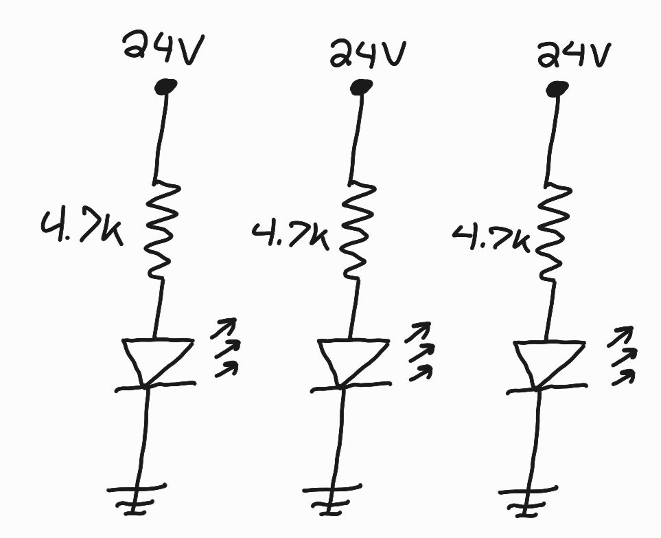

# Simple-LM1875-sound-system
Below is my design for a simple, modular LM1875 bridge-tied-load (BTL) sound system. It is a practical analog amplifier system that is easy to build, has great performance, runs from a wide variety of DC power supplies, and makes for a great analog system design learning project. 

   
  <em>Amplifier system sitting on 3d printed speaker</em>

The system will work with any standard audio signal source input, it does not need to be a bluetooth receiver. In this case my signal source is a [$3 bluetooth reciever module from Amazon](https://www.amazon.com/hiBCTR-Wireless-Bluetooth-Audio-Receiver/dp/B0FDLGMMYC/ref=sr_1_8?crid=350EUMJXBN4NV&dib=eyJ2IjoiMSJ9.Hz_ZgfGwXoIZV5nocs7b126nDdCcdYSbgK9A1z3RJKLhT1cz--GEa3WTc_r3OOHGRY9FarT_VZx-J5lBDyLFj8vOGiySonwBIZ1kvVUOeB1Q8dR2eUkfJ7Q_jlzzyOuEYd0lVI_-uhTDe1ct_fYaA3AArWnHJAKOYzXvK3QndtL3qvyXXTN7THovINOcq88VqpU_mcGi9XMeYuAU9Y2iQcgw7ReGjUXgMcREKI2Z7GU.sa2W5zidMW-tkHYAYGa7TfbJ-GyrVTsSYmgwTngp6ZE&dib_tag=se&keywords=bluetooth+module&qid=1775198601&sprefix=bluetooth+modu%2Caps%2C182&sr=8-8), which is improved with an analog filter stage. You could also use it as a guitar amplifier or something similar.

   
  <em> Image of prototype </em>

The system is modular and consists of two main boards. One is a reciever board that includes an analog filter for reducing DAC noise, followed by a gain stage and output buffer. The other board is an LM1875 power amplifier board with an input buffer, phase splitter, and bridge-tied-load output. Each subystem can be built one at a time on breadboard/perfboard and tested before building the next stage. 

Proper heat sinking is very important for the power stage. I used an [aluminum L bar](https://www.amazon.com/OTTFF-Bracket-Aluminum-Profile-Corner/dp/B0DD3BDWT6/ref=sr_1_13_sspa?crid=NWHNVKTNWDWK&dib=eyJ2IjoiMSJ9.3lqkSy_1tIseBWWlXdlBdSEmRhE-Rx_bb3Os7jGHl061zo6Ga8ugW3anRHhAlIHmEX9L9mXfjqnInrIVF0CHL6XLlJ8O5qnR_Q6PoSIVi2l1GZtheZwjiWftY51wPAiDF5afrFLWItTNZZgt3t-9OmcnLiZ8LC9iwN5BocVDpLeVbqNR0kSKs2d4SOxMVvK_OFKItOmMeJvcVm29MXuqZ8s5Fdgtk36lw4-VXlDhtxwcZhHVL3RORzHaMdX7IZwGdDMlNOx0qafE5TKaUvVn2LjGORAoF8k29z1f6jBQUus.u9ICEjOiQ6GWpiQ1JEwhYfzI56MgqMsP2FVNNBgjboc&dib_tag=se&keywords=aluminum%2Bl%2Bbar&qid=1775218270&s=industrial&sprefix=aluminum%2Bl%2Bb%2Cindustrial%2C161&sr=1-13-spons&sp_csd=d2lkZ2V0TmFtZT1zcF9tdGY&th=1) which gave me space to mount both boards, but you can get by with [significantly smaller heat sinks](https://www.amazon.com/dp/B07B62V4FP?ref=nb_sb_ss_w_as-reorder_k5_1_9&amp=&crid=2OR320LZAT9D7&sprefix=heat%2Bsink&th=1) especially during testing. A small amount of thermal paste significantly improves the thermal transfer from the LM1875 chips to the heat sink.

   
  <em>System block diagram</em>

The LM1875 power stage has a BTL output. This means the output is taken across a pair of amplifiers that have opposite outputs which doubles the voltage. Doubling the voltage increases power output by roughly 4 times compared to a single non BTL LM1875, schematic below, making it more practical to build loud analog amplifiers at low voltage rails.

   
  <em>Schematic:  Power Stage with phase splitter</em>

To make BTL work, we use a phase splitter. The phase splitter takes in one signal, and outputs the original signal as well as its inverted version. The plase splitter outputs drive the LM1875 power amplifier stage. This design runs from a single DC rail instead of positive and negative rails, so the phase splitter and power stage require a virtual ground. It uses a buffered voltage divider to generate and distribute the virtual ground to the TL074 and LM1875 amplifiers. The virtual ground at half the supply voltage is what allows us to run the system with a single +24V rail. 

The power stage is set up as a relatively standard inverting amplifier, but it is not an opamp. The vast majority of amplifier chips cannot drive a power stage. The power stage includes a compensation capacitors in the LM1875 feedback loop (the 56pf capacitors) as well as zobel network (2.2ohm + 0.1uf on output). The LM1875 tends to oscillate without a zobel network so it is very important. The feedback capacitors do a good job of cleaning up square wave edges which indicate good stability. The datasheet for the LM1875 recommends designing it with gains of 10 or greater for stability purposes, so the power stage has 10 gain. 

The reciever board also uses a buffered voltage divider, but its power setup is more complicated due to the addition of the LM7805 and LM7812 voltage regulators. The regulators are seperated from the main power bus by a pi filter. This is helpful for cleaning up some noise from cheap wall power supplies. The 7812 regulator is there to power the 12V analog filter section, and the 7805 regulator is used to power the 5V reciever board. (Depending on opamp and receiver choice, this board could be made to run on a single 3.3V rail.)

   
  <em>Schematic:  Receiver/Filter board</em>

The most important feature of the receiver board is the 2nd order ~35khz cutoff filter. This is what allows us to use various bluetooth receivers, or arbitrary signal sources. The noise is technically higher than audiable frequency, but its good design to get rid of it. The 2nd order filter topography originally came from a Texas Instruments design manual, but they have removed it from the internet. I redesigned it for 35khz and this version works well for audio.

  
   
 <em>Sine wave before (yellow) and after (blue) the 35khz filter</em>

 
This is an example of what the lowpass filter after a DAC accomplishes. The yellow signal is the output from the [bluetooth receiver](https://www.amazon.com/hiBCTR-Wireless-Bluetooth-Audio-Receiver/dp/B0FDLGMMYC/ref=sr_1_8?crid=350EUMJXBN4NV&dib=eyJ2IjoiMSJ9.Hz_ZgfGwXoIZV5nocs7b126nDdCcdYSbgK9A1z3RJKLhT1cz--GEa3WTc_r3OOHGRY9FarT_VZx-J5lBDyLFj8vOGiySonwBIZ1kvVUOeB1Q8dR2eUkfJ7Q_jlzzyOuEYd0lVI_-uhTDe1ct_fYaA3AArWnHJAKOYzXvK3QndtL3qvyXXTN7THovINOcq88VqpU_mcGi9XMeYuAU9Y2iQcgw7ReGjUXgMcREKI2Z7GU.sa2W5zidMW-tkHYAYGa7TfbJ-GyrVTsSYmgwTngp6ZE&dib_tag=se&keywords=bluetooth+module&qid=1775198601&sprefix=bluetooth+modu%2Caps%2C182&sr=8-8), and the blue signal is the output of the 35khz filter. The high frequency noise has been significantly removed, and the output is much cleaner. This sine wave is then reinverted by the gain stage (0-10 gain magnitude) and then finally sent to the output buffer. 

The signal then goes to the input stage of the power stage board, which is another buffer. These buffers are for modularity and stage seperation, but they could be removed. The power stage has 10 gain, and is BTL. 

Power Measurements:

The power stage measurements were taken 'single ended,' which means the measurement are taken from one amplifier output to ground as opposed to taking the output across the load. This is because the bridge-tied-load is floating with respect to ground. To interperet the measurements, you would double the voltage across the load (the output is differential). You could also measure both channels and add them using an oscilloscope math function. 

The power calculations get a little bit complicated due to the BTL changing 'how the amplifier sees the load.' This configuration makes each amplifier half bridge 'see' half the resistance of the load, so it 'sees' 4 ohms when connected to an 8 ohm load. 

  
   
 <em>Left: Test setup    Right: Max power into 8 ohms before clipping</em>

The maximum output voltage before clipping is roughly 14.6V pk-pk per channel. This means the voltage across the load would be 29.2V pk-pk (10.36Vrms). At this point we can use (V^2)/R to estimate a power output of 13.42W before noticable distortion. This is significantly louder than you would expect. It can operate into clipping and still sound good. The power output is similar into a 4 ohm load, but it has less voltage headroom before clipping and and significantly higher current. 

***8 ohm clipping:

  
   
 <em>Left: Onset of clipping with 8 ohm load   Right: Clipping with 8 ohm load</em>

As the system approaches clipping on the output, it gets a little bit of fuzz on top of the sine wave before flattening out with increasing amplitude. When listening to music the bass tends to clip first so it doesnt sound too bad. This system could be designed with two power stages. One for a subwoofer, and one for a mid/tweeter and it would significantly improve any bass clipping issues.

When building this system for the first time it really helps to build a simple version of the power stage. The design below is a simple LM1875 inverting power stage I designed. The output capacitor is very important in this design, but it should be removed for BTL.

   
  <em>LM1875 non BTL inverting power amplifier</em>

This can easily be built on a breadboard, which I have done several times. I've also built several of this power stage to use in my LR4 active system design. It has great performance on its own, but significantly better power performance as a BTL.

Add power board measurements:

Add info about the non BTL inverting amp version:

Add a small schematic showing the 3 LED's on the 24V rails. 4700 ohm resistor, two purple, one white. They are great power indicators and help discharge the large capacitors when it turns off.

   
  <em>Schematic: Power rail LEDs</em>

Add some pictures that include drilling the heat sink and showing jsut the power stage screwed to the heat sink. Mention a little bit of vegetable oil was used with a metal drill bit and it was incredibly easy to drill. The drill bet set was like $8.

Small points: (Clean this up later)

The semiconductors and electrolitic capacitors for this project were ordered from Digikey. The LM1875 chips are the most important component to get from a reliable source. Do not buy them on Amazon. 

The system is powered by a single DC voltage source between 18-30V, and performs great with [cheap 24V wall power supply bricks](https://www.amazon.com/100V-240V-Terminal-Connector-Adapter-5-5x2-1mm/dp/B0CW598HV8/ref=sr_1_2_sspa?crid=SO4U9JPWYUSR&dib=eyJ2IjoiMSJ9.Wj2MH52ngXubGGHn_jR5-tq3j1g8CH6NQ8uUdveCFZiM2RgN0ZBpEiFOTj8VnqWan0aAO3ANwrCY0JCexMZ2bsMjlpHWn8h4nfXn2Z3OHU4LRMzv8ZXsNwfGOxvwVAQx-4uxml4SoSLu7E3XRWt--kh5I8faRnT2te4GcDbC0yMmAZibx5akN4-dxBs6_6iZVO-5CSu8_1-fQMGQsTG-56A2ATmhaNWGmlust4Jhq9M.yrbyAWJkabPssMtkYnAYnOK17R7ZLXuvFp0E1h8N3uQ&dib_tag=se&keywords=24v+power+supply&qid=1775199681&sprefix=24v+power+supply%2Caps%2C168&sr=8-2-spons&sp_csd=d2lkZ2V0TmFtZT1zcF9hdGY&psc=1). This means you do not need to build a power supply to design a similar system.

The speaker below the amplifier is 3D printed, but this system should work with any speaker rated at least 30W. This particular build uses a single [PRV Audio 4 inch midrange 30W RMS speaker](https://www.amazon.com/PRV-4MR60-4-Midrange-Woofer-Speaker/dp/B00RC3Z9H2/ref=sr_1_3_pp?crid=1KCQM80K1PAQ5&dib=eyJ2IjoiMSJ9.x3e2p23kjf49gjaOcO_Ginvh5fZAL4RJupKdT0HOsPY2IyrSVZsr_lAZDN7yt-1VV6PE8BlDJDUVkZxbkw7uh2w71MyDrd3TqlnQbStcCKdQm9OpM0VgmFTw19aUo9BUUvu2CqzZcZzMKE7OF60JZGnQrp6TJ6GPyvxGsvEhPAU0sSh2_lbeOkQgoihgaUo2EBoLWyqMaLDjNgtfGIgXMiGLnHADxxvJDaDK5QvGixg.dlc8fJVgHgVgwpuQZBXRm12JyQiUWVWKJPb0BeQVfCQ&dib_tag=se&keywords=4+ohm+speaker&qid=1775198332&sprefix=4+ohm+speak%2Caps%2C161&sr=8-3), but I have tested it with many other 4 and 8 ohm speakers. This document focuses on the power amplifier and bluetooth reciever boards.

The bluetooth reciever used in this particular build [costs roughly $3 on Amazon.](https://www.amazon.com/hiBCTR-Wireless-Bluetooth-Audio-Receiver/dp/B0FDLGMMYC/ref=sr_1_8?crid=350EUMJXBN4NV&dib=eyJ2IjoiMSJ9.Hz_ZgfGwXoIZV5nocs7b126nDdCcdYSbgK9A1z3RJKLhT1cz--GEa3WTc_r3OOHGRY9FarT_VZx-J5lBDyLFj8vOGiySonwBIZ1kvVUOeB1Q8dR2eUkfJ7Q_jlzzyOuEYd0lVI_-uhTDe1ct_fYaA3AArWnHJAKOYzXvK3QndtL3qvyXXTN7THovINOcq88VqpU_mcGi9XMeYuAU9Y2iQcgw7ReGjUXgMcREKI2Z7GU.sa2W5zidMW-tkHYAYGa7TfbJ-GyrVTsSYmgwTngp6ZE&dib_tag=se&keywords=bluetooth+module&qid=1775198601&sprefix=bluetooth+modu%2Caps%2C182&sr=8-8) This reciever works great and uses incredibly low power, but there are more hifi options. There are also no offical datasheets avalible for the chip, but it is still easy to work with. The analog filter after the bluetooth reciever significanly improves the signal quality and makes it usable in a system like this.

The power rails include bulk electrolitic capacitors and small ceramic capacitors. It is important to have at least a few thousand uF of capacitance on the power rails for the LM1875 board. It is also important to keep 0.1uf ceramic capacitors immediately near each chip's power pins. I tend to add a 0.1uf capacitor in parallel next to each bulk cap, and then a few extras around the board for good measure. 

Dropping 24V to 5V on a linear regulator is a lot, and the rail draws more than ~15-20mA of current it will get extremely hot. You may need a buck converter instead of linear regulator depending on the reciever, or you could use a reciever on a completely different board.

There is a lot of wiggle room for capacitance on the rails. For the capacitor voltage rating, use a value that is around 50% higher than your power rail. For a 24V rail you want to use at least 35V rated capacitors. I used 50V rated capacitors in my build.

The reciever is interchangable, and the system would greatly benifit from a higher quality reciever. One can be made with an ESP32 and PCM5102 module, or you can use a professoinal bluetooth reciever. Depending on what reciever you use, you can get by without the filter board entirely.

The receiver board could be used with any other amplifier system, but you may want to re-design the voltage rails.
